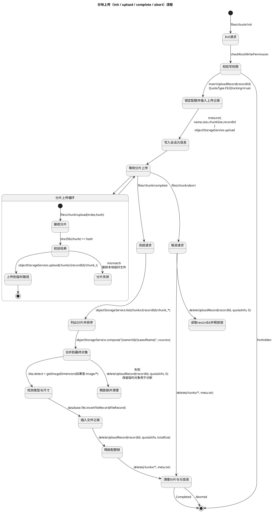

# 分块上传流程（PlantUML）

以下为分块上传（init/upload/complete/abort）流程的状态图，可直接用 PlantUML 渲染。

```plantuml
@startuml
title 分块上传（init / upload / complete / abort）流程

[*] --> Init请求 : files/chunk/init
Init请求 --> 校验写权限 : checkRootWritePermission
校验写权限 --> 锁定配额并插入上传记录 : insertUploadRecord(recordId)\nQuotaType.FILE(locking=true)
校验写权限 --> [*] : Forbidden

锁定配额并插入上传记录 --> 写入会话元信息 : meta.txt{\nname,size,chunkSize,recordId\n}\nobjectStorageService.upload
写入会话元信息 --> 等待分片上传

state "分片上传循环" as 上传循环 {
  [*] --> 接收分片 : files/chunk/upload(index,hash)
  接收分片 --> 校验哈希 : sha256(chunk) == hash
校验哈希 --> 上传到临时路径 : objectStorageService.upload(chunks/{recordId}/chunk_i)
  校验哈希 --> 分片失败 : mismatch\n删除本地临时文件
  上传到临时路径 --> [*]
}

等待分片上传 --> 上传循环
上传循环 --> 等待分片上传

等待分片上传 --> 完成请求 : files/chunk/complete
完成请求 --> 列出分片并排序 : objectStorageService.list(chunks/{recordId}/chunk_*)
列出分片并排序 --> 合并到最终对象 : objectStorageService.compose("{ownerId}/{savedName}", sources)
合并到最终对象 --> 检测类型与尺寸 : tika.detect + getImageDimension(如果是 image/*)
合并到最终对象 --> 释放锁并清理 : 失败\ndeleteUploadRecord(recordId, quotaInfo, 0)\n保留临时对象用于诊断

检测类型与尺寸 --> 插入文件记录 : database.file.insertFileRecord(FileRecord)
插入文件记录 --> 释放配额锁 : deleteUploadRecord(recordId, quotaInfo, totalSize)
释放配额锁 --> 清理分片与元信息 : delete(chunks/*, meta.txt)
清理分片与元信息 --> [*] : Completed

等待分片上传 --> 取消请求 : files/chunk/abort
取消请求 --> 读取recordId并释放锁 : deleteUploadRecord(recordId, quotaInfo, 0)
取消请求 --> 清理分片与元信息 : delete(chunks/*, meta.txt)
清理分片与元信息 --> [*] : Aborted

@enduml
```
