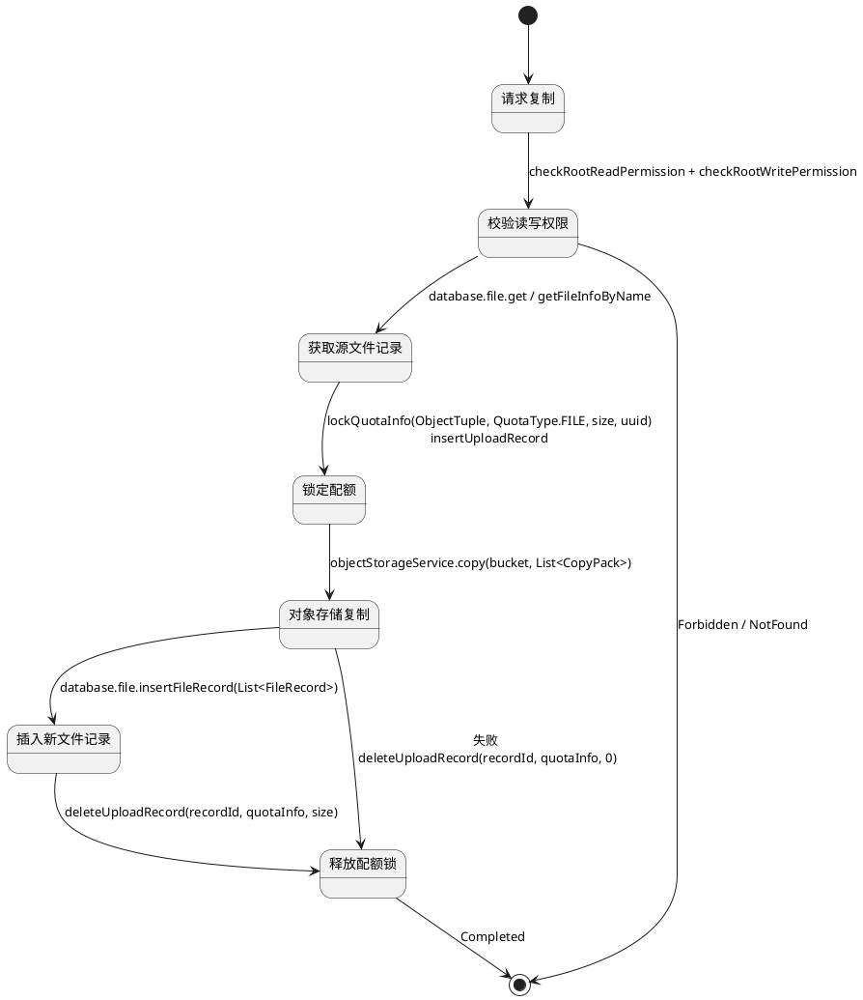

# 文件复制流程（PlantUML）

以下为复制文件流程的状态图，可直接用 PlantUML 渲染。

```plantuml
@startuml
[*] --> 请求复制

请求复制 --> 校验读写权限 : checkRootReadPermission + checkRootWritePermission
校验读写权限 --> 获取源文件记录 : database.file.get / getFileInfoByName
校验读写权限 --> [*] : Forbidden / NotFound

获取源文件记录 --> 锁定配额 : lockQuotaInfo(ObjectTuple, QuotaType.FILE, size, uuid)\ninsertUploadRecord
锁定配额 --> 对象存储复制 : objectStorageService.copy(bucket, List<CopyPack>)
对象存储复制 --> 插入新文件记录 : database.file.insertFileRecord(List<FileRecord>)
对象存储复制 --> 释放配额锁 : 失败\n deleteUploadRecord(recordId, quotaInfo, 0)

插入新文件记录 --> 释放配额锁 : deleteUploadRecord(recordId, quotaInfo, size)
释放配额锁 --> [*] : Completed
@enduml

```

