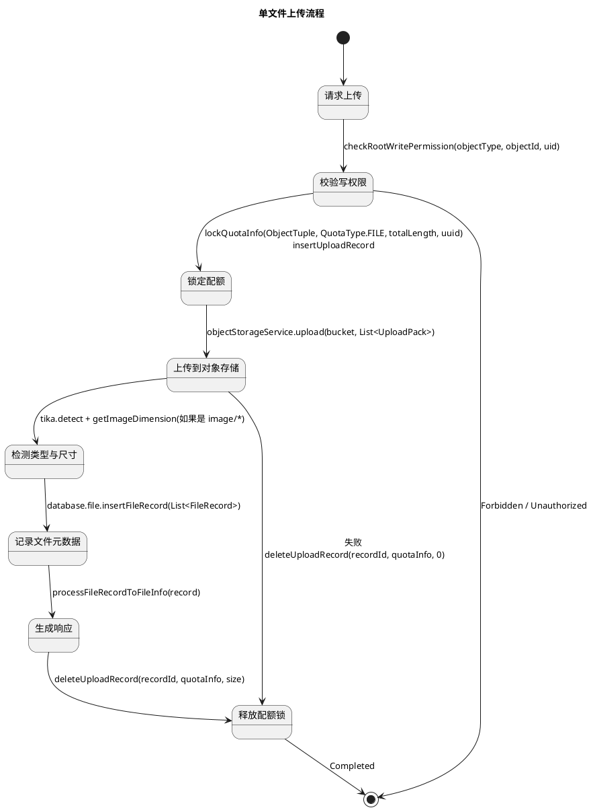

# 单文件上传流程（PlantUML）

以下为单文件上传流程的状态图，可直接用 PlantUML 渲染。

```plantuml
@startuml
title 单文件上传流程

[*] --> 请求上传
请求上传 --> 校验写权限 : checkRootWritePermission(objectType, objectId, uid)
校验写权限 --> 锁定配额 : lockQuotaInfo(ObjectTuple, QuotaType.FILE, totalLength, uuid)\ninsertUploadRecord
校验写权限 --> [*] : Forbidden / Unauthorized

锁定配额 --> 上传到对象存储 : objectStorageService.upload(bucket, List<UploadPack>)
上传到对象存储 --> 检测类型与尺寸 : tika.detect + getImageDimension(如果是 image/*)
上传到对象存储 --> 释放配额锁 : 失败\n deleteUploadRecord(recordId, quotaInfo, 0)

检测类型与尺寸 --> 记录文件元数据 : database.file.insertFileRecord(List<FileRecord>)
记录文件元数据 --> 生成响应 : processFileRecordToFileInfo(record)
生成响应 --> 释放配额锁 : deleteUploadRecord(recordId, quotaInfo, size)
释放配额锁 --> [*] : Completed

@enduml

```

