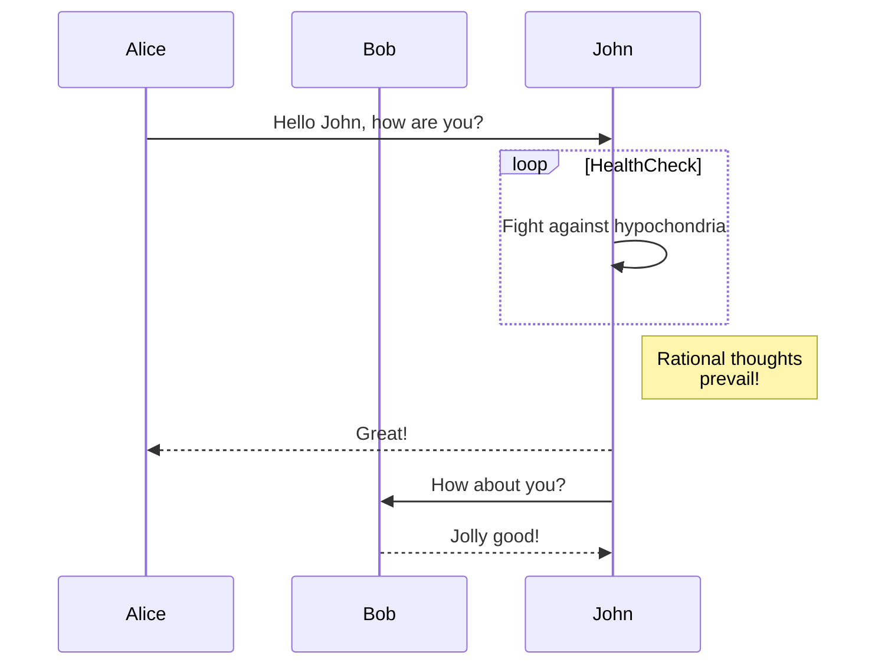
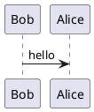
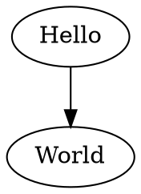

You can use Discover in Kibana to interactively search and filter your data. From there, you can start creating visualizations and building and sharing dashboards. `@user1`

```csa
/user/a/user1
```






